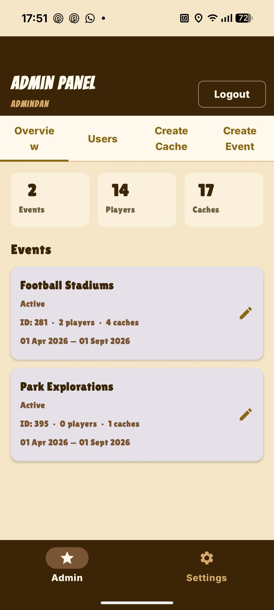
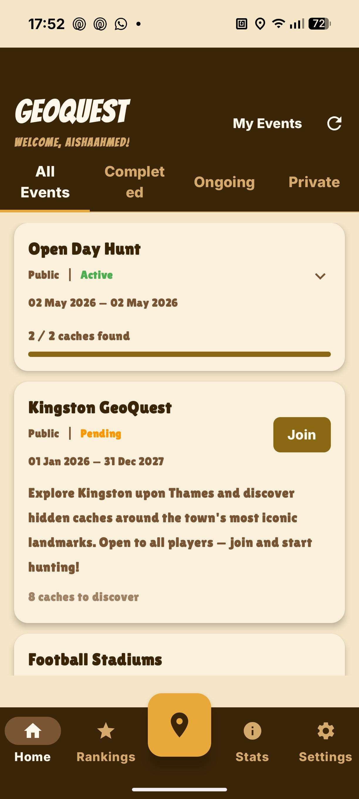

# MAD-PROJECT---GEOQUEST

Location Based Treasure Hunt App  

Members: Danish & Asvin  

---

Theme Inspired by One Piece Anime  
Navigation Bar Inspired by game Paper.io 2  

---

## Application

Two pathways:
- Admin
- User/Player  

---

## Admin Pathway

  

Admin Pathway accessible through login below:  

**Username:** AdminDan  
**Password:** AdminAccess  

Admin Pathway was created in order for me to create public events. It includes functionality of creating, deleting, editing and publishing public events.  

The admin is also able to manage the users, deleting users if any errors seem to pop up.  

---

## User/Player Pathway

  

Accessible through:  
creating your own account or use existing account already made.  

### Account ONE
**Username:** aishaahmed  
**Password:** password  

### Account TWO
**Username:** Officially  
**Password:** password  

---

Users/players can:
- join public/private events  
- create their own private events and manage the events caches and details  
- view leaderboards for both private and public events  
- manage their account deletion and editing. both which can only be done by going through verification method (e.g. password, phone number)
