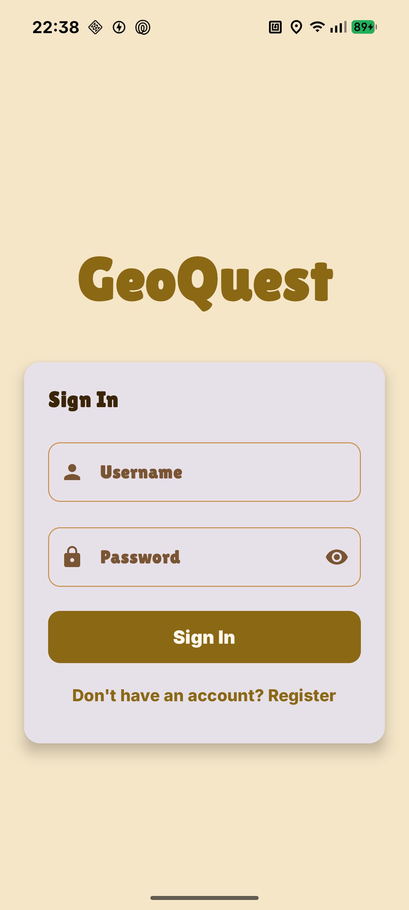
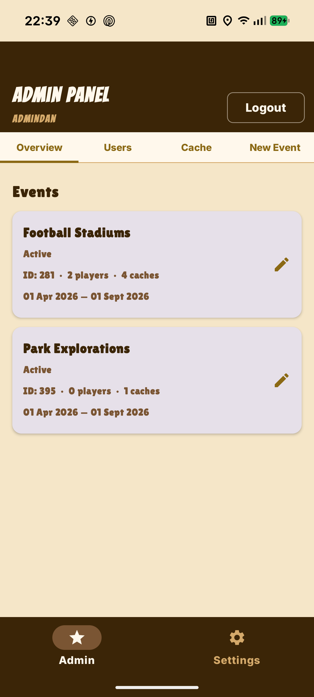
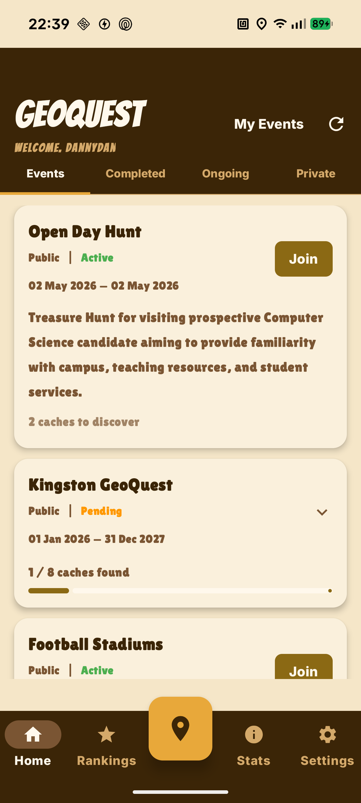

# MAD-PROJECT---GEOQUEST

Location Based Treasure Hunt App  

Members: Danish & Asvin  

---

## Steps to Get App Running

### ANDROID PHONE ROUTE
- Go to settings  
- Tap about phone and click build number 7 times to enable developer options  
- Enable USB debugging  
- Plug your phone to your Laptop (or any device you using) and make sure you allow usb debugging  
- Open android studio and clone the repository  
- Phone should automatically appear as choice to run app  
- Run the app on android studio and let it install on your phone  
- Explore the application  

---

### EMULATOR ROUTE (LIMITED FUNCTIONALITY)
- Clone the repository  
- Make sure you have device selected (Medium Phone recommended)  
- Run the application  
- Explore the application  

---

**COMPASS WILL NOT WORK, CAMERA MAY NOT WORK, LOCATION CAN BE SET VIA EXTERNAL EMULATOR SETTINGS**

---

## Theme Inspired by One Piece Anime  
## Navigation Bar Inspired by game Paper.io 2  

  

---

## Application

Two pathways:
- Admin  
- User/Player  

---

## Admin Pathway

  

Admin Pathway accessible through login below:  

**Username:** AdminDan  
**Password:** AdminAccess  

Why Admin Created:
- Manage public events, caches, and Users  
- Add new caches, create new public events  
- Makes it easier to handle public events  

---

## User/Player Pathway

  

Accessible through:  
Creating your own account or use existing account already made.  

### Account ONE
**Username:** aishaahmed  
**Password:** password  

### Account TWO
**Username:** Officially  
**Password:** password 

### Account THREE
**Username:** DannyDan 
**Password:** password 

---

## Users/Players Can
- Join public/private events  
- Create their own private events and manage the events caches and details  
- View leaderboards for both private and public events  
- Manage their account deletion and editing, both which can only be done by going through verification method (e.g. password, phone number)

---
## Caches
- Caches are locked until you are in range of the caches
- if you are within 200m of a cache you will recieve a clue
- if you are within 50m of a cache you can log the cache as found
- private events created by the ownders are not able to view the caches in those events by the owners
- you are presented option to either log caches as found by taking the photos or just loggin caches by yourself

---
## Leaderboard
- You can view Leaderboard for both private and public events
- you are given option to view leaderboard for caches found or for points accumulated
- you are given option to view leaderboard for specific public/private events or for all

